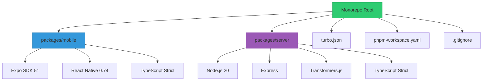
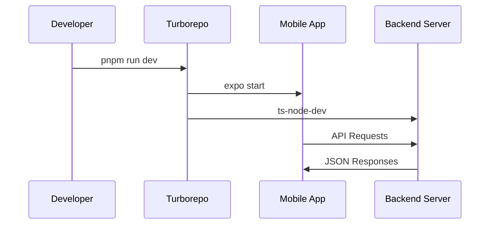

# Mood-Based Content Curator Architecture



## 1. Monorepo Structure
```
mbcc/
├── packages/
│   ├── mobile/
│   │   ├── src/
│   │   ├── __tests__/
│   │   ├── package.json
│   │   ├── tsconfig.json
│   │   ├── .eslintrc.js
│   │   └── jest.config.js
│   └── server/
│       ├── src/
│       ├── __tests__/
│       ├── package.json
│       ├── tsconfig.json
│       ├── .eslintrc.js
│       └── jest.config.js
├── turbo.json
├── pnpm-workspace.yaml
├── .gitignore
└── ARCHITECTURE.md
```

## 2. Root Configuration Files

**turbo.json**:
```json
{
  "$schema": "https://turborepo.org/schema.json",
  "pipeline": {
    "build": {
      "dependsOn": ["^build"],
      "outputs": ["dist/**"]
    },
    "test": {
      "dependsOn": ["build"],
      "outputs": []
    },
    "lint": {
      "outputs": []
    },
    "dev": {
      "cache": false
    }
  }
}
```

**pnpm-workspace.yaml**:
```yaml
packages:
  - 'packages/*'
```

**.gitignore**:
```
node_modules/
dist/
.expo/
.env
*.log
```

## 3. Mobile Package (React Native)

**package.json**:
```json
{
  "name": "mobile",
  "version": "1.0.0",
  "scripts": {
    "start": "expo start",
    "android": "expo start --android",
    "ios": "expo start --ios",
    "web": "expo start --web",
    "test": "jest",
    "lint": "eslint . --max-warnings=0"
  },
  "dependencies": {
    "expo": "~51.0.0",
    "expo-status-bar": "~1.10.0",
    "react": "18.2.0",
    "react-native": "0.74.1"
  },
  "devDependencies": {
    "@types/react": "~18.2.45",
    "@types/react-native": "~0.74.1",
    "@typescript-eslint/eslint-plugin": "^7.3.0",
    "@typescript-eslint/parser": "^7.3.0",
    "eslint": "^8.57.0",
    "eslint-config-prettier": "^9.1.0",
    "eslint-plugin-react": "^7.33.2",
    "eslint-plugin-react-hooks": "^4.6.0",
    "jest": "^29.7.0",
    "typescript": "5.4.2"
  }
}
```

**tsconfig.json** (strict mode):
```json
{
  "compilerOptions": {
    "allowJs": true,
    "allowSyntheticDefaultImports": true,
    "esModuleInterop": true,
    "isolatedModules": true,
    "jsx": "react-native",
    "lib": ["esnext"],
    "moduleResolution": "node",
    "noEmit": true,
    "strict": true,
    "target": "esnext"
  }
}
```

## 4. Server Package (Node.js)

**package.json**:
```json
{
  "name": "server",
  "version": "1.0.0",
  "scripts": {
    "build": "tsc",
    "start": "node dist/index.js",
    "dev": "ts-node-dev src/index.ts",
    "test": "jest",
    "lint": "eslint . --max-warnings=0"
  },
  "dependencies": {
    "express": "4.19.2",
    "@xenova/transformers": "^2.17.0"
  },
  "devDependencies": {
    "@types/express": "4.17.21",
    "@types/jest": "^29.5.12",
    "@types/node": "20.14.0",
    "@typescript-eslint/eslint-plugin": "^7.3.0",
    "@typescript-eslint/parser": "^7.3.0",
    "eslint": "^8.57.0",
    "eslint-config-prettier": "^9.1.0",
    "jest": "^29.7.0",
    "ts-jest": "^29.1.2",
    "ts-node-dev": "^2.0.0",
    "typescript": "5.4.2"
  }
}
```

**tsconfig.json** (strict mode):
```json
{
  "compilerOptions": {
    "target": "ES2020",
    "module": "commonjs",
    "outDir": "dist",
    "rootDir": "src",
    "strict": true,
    "esModuleInterop": true,
    "skipLibCheck": true,
    "forceConsistentCasingInFileNames": true
  }
}
```

## 5. Quality Assurance

**ESLint Configuration** (both packages):
- Airbnb base config
- TypeScript support
- React hooks rules
- Prettier integration
- `--max-warnings=0` enforced

**Jest Configuration**:
- 100% test coverage requirement
- Transformers for TypeScript
- Mocking for native modules

## 6. Architectural Decisions

1. **Monorepo with Turborepo**: Enables:
   - Shared tooling configuration
   - Cross-package dependencies
   - Cached builds (turbo)
   - Atomic deployments

2. **React Native with Expo**:
   - Unified development workflow
   - Over-the-air updates
   - Managed native dependencies

3. **Transformers.js**:
   - Browser-based ML without Python
   - Pretrained sentiment analysis models
   - ONNX runtime for performance

4. **Strict Quality Gates**:
   - TypeScript strict null checks
   - ESLint zero-warning policy
   - Jest 85% coverage enforcement

## 7. Development Workflow



To implement:
1. `pnpm install` - Install dependencies
2. `pnpm run dev` - Start dev environment
3. `pnpm run test` - Run all tests
4. `pnpm run lint` - Check code quality