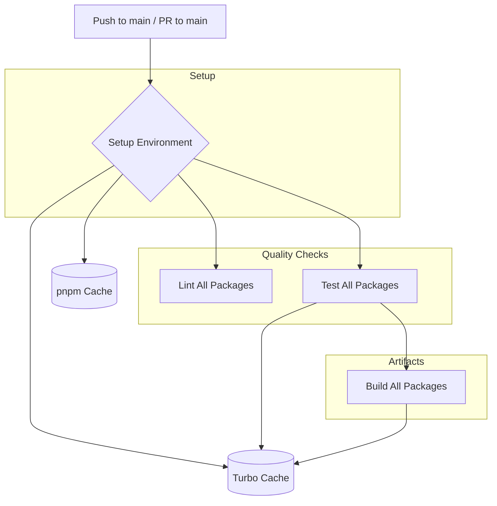

# CI/CD Architectural Plan for Monorepo

This plan details the strategy for implementing Continuous Integration and Continuous Delivery (CI/CD) using GitHub Actions for the `mbcc` monorepo, which includes `mobile` (React Native/Expo) and `server` (Node.js/Express) packages managed with pnpm workspaces and Turborepo.

## 1. Core Principles

*   **Efficiency:** Leverage Turborepo's caching and incremental builds to minimize CI run times.
*   **Isolation:** Test and build packages independently where possible, but also ensure integration.
*   **Automation:** Automate linting, testing, building, and potentially deployment.
*   **Clarity:** Provide clear feedback on PRs regarding build status, test results, and coverage.
*   **Scalability:** Design workflows that can adapt as the project grows.

## 2. CI Pipeline Strategy

The CI pipeline will be triggered on pushes to `main` and on every pull request targeting `main`.

*   **Monorepo Awareness:** GitHub Actions will be configured to understand the monorepo structure. Turborepo's `affected` commands will be key to only run tasks on packages that have changed.
*   **Parallelism:** Jobs for different packages (mobile, server) or different tasks (lint, test, build) can run in parallel where appropriate to speed up the pipeline.
*   **Caching:**
    *   **pnpm dependencies:** Cache installed dependencies to speed up setup.
    *   **Turborepo cache:** Persist Turborepo's remote cache to avoid re-running tasks on unchanged code.
    *   **Build artifacts:** Cache build outputs if they are needed by subsequent jobs or for deployment.

## 3. Testing Strategy

*   **Unit & Integration Tests:** Each package (`mobile` and `server`) will have its own Jest test suite.
*   **Test Execution:** Tests will be run using `turbo run test`. Turborepo will ensure tests are only run for affected packages.
*   **Code Coverage:**
    *   Jest will generate code coverage reports.
    *   **Initial Threshold:** A global threshold of **85%** (lines, statements, functions, branches) will be enforced for both `mobile` and `server` packages.
    *   **Future Goal:** Incrementally increase this threshold towards 90-100% as the project matures.
    *   Coverage reports can be uploaded as artifacts and potentially integrated with services like Codecov or Coveralls for better visualization and tracking.
*   **End-to-End (E2E) Tests (Future Consideration):** While not in the immediate scope, the CI setup should be extensible to include E2E tests for the mobile app (e.g., using Detox or Appium) and API tests for the server.

## 4. GitHub Actions Workflow Design

We'll create a main CI workflow file (e.g., `.github/workflows/ci.yml`).

**Workflow Triggers:**

*   `on: [push, pull_request]`
    *   `push`: branches: `main` (for deployments or release tagging if applicable later)
    *   `pull_request`: branches: `main`

**Key Jobs:**

1.  **`lint` Job:**
    *   Checks out code.
    *   Sets up Node.js and pnpm.
    *   Installs dependencies (with pnpm caching).
    *   Runs `pnpm lint` (which internally uses `turbo run lint`). This will lint all affected packages.

2.  **`test` Job:**
    *   Needs: `lint` (optional, can run in parallel)
    *   Checks out code.
    *   Sets up Node.js and pnpm.
    *   Installs dependencies (with pnpm caching).
    *   Restores Turborepo remote cache (if available).
    *   Runs `pnpm test -- --coverage` (which internally uses `turbo run test -- --coverage`). This will run tests for all affected packages and generate coverage reports.
    *   Enforces the 85% coverage threshold. If tests pass but coverage is below threshold, the job should fail.
    *   Uploads coverage reports as artifacts.
    *   Saves Turborepo remote cache.

3.  **`build` Job:**
    *   Needs: `test`
    *   Checks out code.
    *   Sets up Node.js and pnpm.
    *   Installs dependencies (with pnpm caching).
    *   Restores Turborepo remote cache.
    *   Runs `pnpm build` (which internally uses `turbo run build`). This will build all affected packages.
    *   Uploads build artifacts (e.g., `dist` folders for server, Expo build outputs for mobile if applicable at this stage).
    *   Saves Turborepo remote cache.

**Workflow Visualization (Mermaid Diagram):**



**Detailed Workflow Steps (Conceptual):**

```yaml
# .github/workflows/ci.yml (Conceptual Structure)
name: Monorepo CI

on:
  push:
    branches: [ main ]
  pull_request:
    branches: [ main ]

jobs:
  lint:
    runs-on: ubuntu-latest
    steps:
      - uses: actions/checkout@v4
      - name: Setup pnpm
        uses: pnpm/action-setup@v3
        with:
          version: 8 # Or match your package.json
      - name: Setup Node.js
        uses: actions/setup-node@v4
        with:
          node-version: '20' # Or match your package.json
          cache: 'pnpm'
      - name: Install dependencies
        run: pnpm install --frozen-lockfile
      - name: Lint
        run: pnpm lint # Uses turbo run lint

  test:
    runs-on: ubuntu-latest
    needs: lint # Optional: can run in parallel if preferred
    steps:
      - uses: actions/checkout@v4
      - name: Setup pnpm
        uses: pnpm/action-setup@v3
        with:
          version: 8
      - name: Setup Node.js
        uses: actions/setup-node@v4
        with:
          node-version: '20'
          cache: 'pnpm'
      - name: Install dependencies
        run: pnpm install --frozen-lockfile
      # Turborepo Remote Caching (Example using GitHub Actions Cache)
      - name: Restore Turborepo cache
        uses: actions/cache@v4
        with:
          path: .turbo
          key: ${{ runner.os }}-turbo-${{ github.sha }}
          restore-keys: |
            ${{ runner.os }}-turbo-
      - name: Test & Check Coverage
        run: pnpm test -- --coverage # Uses turbo run test -- --coverage
        # Add a step here to check Jest's output/exit code for coverage enforcement
        # Or use a dedicated action for coverage reporting and threshold checking
      - name: Upload coverage reports
        uses: actions/upload-artifact@v4
        with:
          name: coverage-reports
          path: |
            packages/mobile/coverage/
            packages/server/coverage/
      - name: Save Turborepo cache
        uses: actions/cache@v4
        with:
          path: .turbo
          key: ${{ runner.os }}-turbo-${{ github.sha }}

  build:
    runs-on: ubuntu-latest
    needs: test
    steps:
      - uses: actions/checkout@v4
      - name: Setup pnpm
        uses: pnpm/action-setup@v3
        with:
          version: 8
      - name: Setup Node.js
        uses: actions/setup-node@v4
        with:
          node-version: '20'
          cache: 'pnpm'
      - name: Install dependencies
        run: pnpm install --frozen-lockfile
      - name: Restore Turborepo cache
        uses: actions/cache@v4
        with:
          path: .turbo
          key: ${{ runner.os }}-turbo-${{ github.sha }} # Should match key from test job for effectiveness
          restore-keys: |
            ${{ runner.os }}-turbo-
      - name: Build
        run: pnpm build # Uses turbo run build
      - name: Upload build artifacts (server)
        uses: actions/upload-artifact@v4
        with:
          name: server-build
          path: packages/server/dist/
      # Add similar for mobile if specific build artifacts are needed (e.g., expo export)
      - name: Save Turborepo cache
        uses: actions/cache@v4
        with:
          path: .turbo
          key: ${{ runner.os }}-turbo-${{ github.sha }}
```

**Notes on Turborepo Remote Caching:**
GitHub Actions Cache can be used for Turborepo's remote cache. For more robust or larger-scale projects, dedicated remote caching services (like Vercel's own, or self-hosted options like `turbo-cache-server`) might be considered in the future. For now, GitHub Actions Cache should suffice.

## 5. PR/Issue Template Requirements

Create the following files in the `.github` directory:

*   **`.github/PULL_REQUEST_TEMPLATE.md`**:
    *   Link to related issue(s).
    *   Summary of changes.
    *   How to test/verify changes.
    *   Screenshots/GIFs for UI changes (especially for `mobile`).
    *   Checklist (e.g., tests added, documentation updated).

*   **`.github/ISSUE_TEMPLATE/bug_report.md`**:
    *   Clear and concise description of the bug.
    *   Steps to reproduce.
    *   Expected behavior.
    *   Actual behavior.
    *   Environment (e.g., OS, browser, app version, Node.js version).
    *   Screenshots/logs if applicable.

*   **`.github/ISSUE_TEMPLATE/feature_request.md`**:
    *   Description of the problem the feature solves.
    *   Proposed solution/functionality.
    *   Alternatives considered.
    *   Additional context.

*   **`.github/ISSUE_TEMPLATE/config.yml`** (to configure the "New Issue" chooser):
    ```yaml
    blank_issues_enabled: false
    contact_links:
      - name: Project Readme
        url: ./README.md # Adjust if your README is elsewhere or you have a dedicated docs site
        about: Please check the project documentation first.
    ```

## 6. Additional CI/CD Best Practices

*   **Branch Protection Rules:** Protect the `main` branch. Require status checks (lint, test, build) to pass before merging. Require PR reviews.
*   **Dependency Updates:** Consider using tools like Dependabot to automate dependency updates and create PRs for them. The CI pipeline will then test these updates.
*   **Secrets Management:** Use GitHub Actions secrets for any sensitive information (e.g., API keys, deployment tokens) if/when deployment stages are added.
*   **Notifications:** Configure notifications (e.g., on Slack or email) for failed builds on `main` or important PRs.
*   **Semantic Versioning & Changelog (Future):** As the project matures, consider automating version bumps and changelog generation (e.g., using `semantic-release`).
*   **Mobile Specifics:**
    *   For actual mobile app builds (IPA/APK), dedicated Expo EAS Build or similar services integrated into GitHub Actions would be necessary. This plan focuses on CI (lint, test, JS build) for now.
    *   Consider matrix builds for different mobile environments if needed later.
*   **Server Specifics:**
    *   If deploying the server, the `build` job's artifacts would be used in a subsequent `deploy` job.
    *   Consider Dockerizing the server application for easier deployment and consistency.

## 7. Next Steps (Implementation Phase)

1.  **Adjust Jest Configurations:** Update `packages/mobile/jest.config.js` and `packages/server/jest.config.js` to set the global coverage threshold to 85%.
2.  **Create GitHub Actions Workflow:** Implement the `ci.yml` file as outlined.
3.  **Create PR/Issue Templates:** Add the `.md` files in the `.github` directory.
4.  **Configure Branch Protection Rules:** Set up rules for the `main` branch in GitHub repository settings.
5.  **Iterate and Refine:** Monitor CI runs, optimize caching, and adjust configurations as needed.

This plan provides a solid foundation for your CI/CD setup.