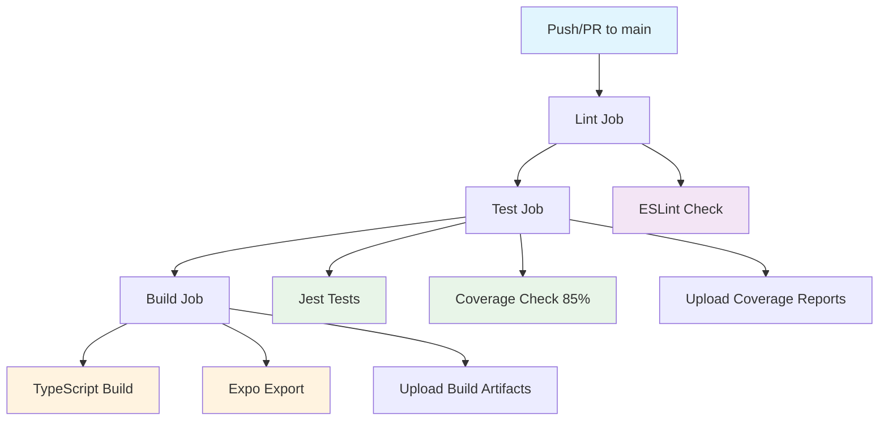

# CI/CD Implementation Summary

## ✅ Completed Implementation

### 1. Jest Configuration Updates
- **Mobile Package**: Updated [`packages/mobile/jest.config.js`](packages/mobile/jest.config.js) to set coverage threshold to 85%
- **Server Package**: Updated [`packages/server/jest.config.js`](packages/server/jest.config.js) to set coverage threshold to 85%

### 2. GitHub Actions Workflow
- **Created**: [`.github/workflows/ci.yml`](.github/workflows/ci.yml)
- **Features**:
  - Triggers on push to `main` and pull requests to `main`
  - Three sequential jobs: `lint` → `test` → `build`
  - Turborepo caching for efficient builds
  - pnpm dependency caching
  - Coverage report uploads
  - Build artifact uploads

### 3. GitHub Templates
- **Pull Request Template**: [`.github/PULL_REQUEST_TEMPLATE.md`](.github/PULL_REQUEST_TEMPLATE.md)
- **Bug Report Template**: [`.github/ISSUE_TEMPLATE/bug_report.md`](.github/ISSUE_TEMPLATE/bug_report.md)
- **Feature Request Template**: [`.github/ISSUE_TEMPLATE/feature_request.md`](.github/ISSUE_TEMPLATE/feature_request.md)
- **Issue Template Config**: [`.github/ISSUE_TEMPLATE/config.yml`](.github/ISSUE_TEMPLATE/config.yml)

### 4. Package Scripts
- **Mobile Package**: Added `build: "expo export"` script to [`packages/mobile/package.json`](packages/mobile/package.json)
- **Server Package**: Already had `build: "tsc"` script

## 🔧 Next Steps for Full CI/CD Setup

### 1. Repository Configuration (Manual Steps)

#### Branch Protection Rules
Navigate to your GitHub repository settings and configure:
- **Branch**: `main`
- **Require status checks**: ✅
  - `lint`
  - `test` 
  - `build`
- **Require pull request reviews**: ✅
- **Dismiss stale reviews**: ✅
- **Require review from code owners**: ✅ (optional)
- **Restrict pushes to matching branches**: ✅

#### GitHub Actions Permissions
Ensure GitHub Actions has the necessary permissions:
- Go to Settings → Actions → General
- Set "Workflow permissions" to "Read and write permissions"

### 2. Optional Enhancements

#### Dependabot Configuration
Create [`.github/dependabot.yml`](.github/dependabot.yml):
```yaml
version: 2
updates:
  - package-ecosystem: "npm"
    directory: "/"
    schedule:
      interval: "weekly"
    open-pull-requests-limit: 10
```

#### Code Coverage Integration
Consider integrating with:
- **Codecov**: For detailed coverage reports and PR comments
- **Coveralls**: Alternative coverage service
- **GitHub Actions Coverage**: Using actions like `codecov/codecov-action`

#### Semantic Release (Future)
For automated versioning and changelog generation:
- Install `semantic-release`
- Configure release workflow
- Set up conventional commit standards

### 3. Testing the CI/CD Pipeline

#### Initial Test
1. Create a feature branch
2. Make a small change (e.g., update README.md)
3. Push the branch and create a PR
4. Verify all CI checks pass

#### Coverage Test
1. Add a simple test file to verify coverage thresholds work
2. Ensure tests pass and coverage meets 85% threshold

#### Build Test
1. Verify both packages build successfully
2. Check that build artifacts are uploaded correctly

## 📋 Workflow Overview



## 🎯 Key Benefits Achieved

1. **Automated Quality Checks**: Every PR is automatically linted and tested
2. **Coverage Enforcement**: 85% code coverage threshold prevents quality regression
3. **Efficient Builds**: Turborepo caching minimizes CI run times
4. **Standardized Process**: Templates ensure consistent PR and issue reporting
5. **Monorepo Awareness**: CI understands and handles both mobile and server packages
6. **Artifact Management**: Build outputs are preserved for potential deployment

## 🚀 Ready for Development

The CI/CD pipeline is now ready to support your development workflow. The next commit to `main` or any new pull request will trigger the automated pipeline and validate code quality, tests, and builds.

## 📚 Related Documentation

- [CI/CD Architectural Plan](CICD_PLAN.md) - Detailed planning document
- [Project Architecture](ARCHITECTURE.md) - Overall project structure
- [Turborepo Documentation](https://turbo.build/repo/docs) - Build system reference
- [GitHub Actions Documentation](https://docs.github.com/en/actions) - CI/CD platform reference