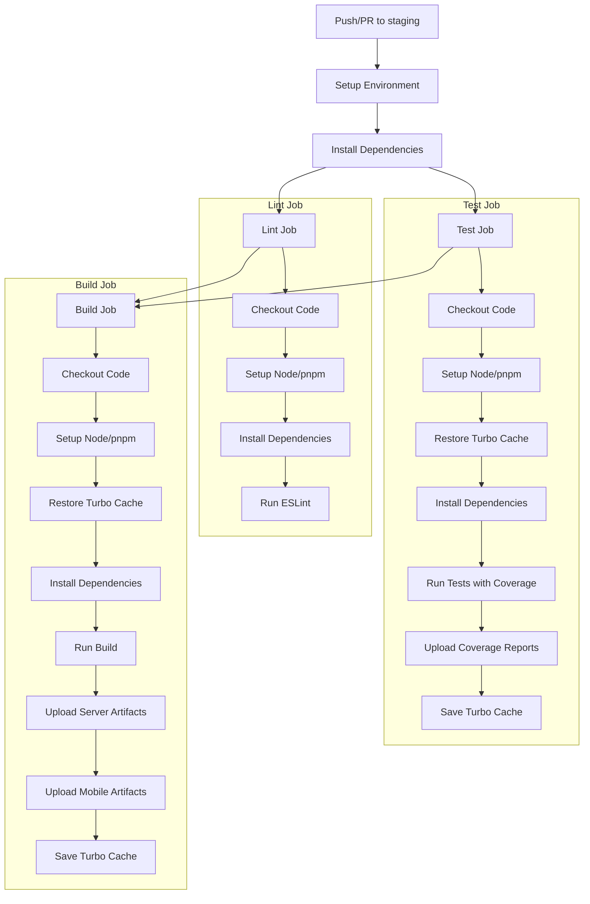

# CI/CD Implementation Summary

## Overview
This document summarizes the complete implementation of the CI/CD pipeline for the MBCC monorepo, including all fixes and enhancements made to the original plan.

## ✅ Completed Implementations

### 1. Package Dependencies Fixed
- **Mobile Package** (`packages/mobile/package.json`):
  - ✅ Added `@testing-library/react-native@^12.4.2`
  - ✅ Added `@testing-library/jest-native@^5.4.3`
  - ✅ Added `react-test-renderer@18.2.0`
  - ✅ Reorganized dependencies alphabetically

- **Server Package** (`packages/server/package.json`):
  - ✅ Added `@jest/types@^29.6.3`
  - ✅ Added `supertest@^6.3.4`
  - ✅ Added `@types/supertest@^6.0.2`
  - ✅ Reorganized dependencies alphabetically

### 2. Turbo Configuration Enhanced
- **Updated `turbo.json`**:
  - ✅ Added `.expo/**` to build outputs for mobile builds
  - ✅ Added `coverage/**` to test outputs for coverage reports
  - ✅ Added `persistent: true` to dev task for long-running processes
  - ✅ Added `clean` task configuration
  - ✅ Maintained proper task dependencies

### 3. Jest Configurations Improved
- **Mobile Jest Config** (`packages/mobile/jest.config.js`):
  - ✅ Added `@testing-library/jest-native/extend-expect` to setup
  - ✅ Added coverage reporters: `['text', 'lcov', 'html']`
  - ✅ Added transform ignore patterns for React Native modules
  - ✅ Excluded story files from coverage
  - ✅ Maintained 85% coverage threshold

- **Server Jest Config** (`packages/server/jest.config.js`):
  - ✅ Added coverage reporters: `['text', 'lcov', 'html']`
  - ✅ Added Jest setup file reference
  - ✅ Excluded index.ts files from coverage
  - ✅ Maintained 85% coverage threshold

### 4. Jest Setup Files Created
- **Server Setup** (`packages/server/jest.setup.js`):
  - ✅ Created Jest setup file for server package
  - ✅ Added test environment configuration
  - ✅ Added console mocking utilities
  - ✅ Fixed ESLint compatibility

### 5. GitHub Workflow Enhanced
- **Updated `.github/workflows/ci.yml`**:
  - ✅ Improved Turborepo caching with pnpm-lock.yaml hash
  - ✅ Added mobile build artifacts upload
  - ✅ Added conditional artifact uploads based on file changes
  - ✅ Consistent cache keys across all jobs
  - ✅ Maintained staging branch targeting

### 6. Dependency Management Added
- **Created `.github/dependabot.yml`**:
  - ✅ Weekly dependency updates for root, mobile, and server packages
  - ✅ GitHub Actions dependency updates
  - ✅ Proper commit message formatting
  - ✅ Reasonable PR limits to avoid spam
  - ✅ Scheduled for Monday mornings

### 7. Branch Protection Documentation
- **Created `BRANCH_PROTECTION.md`**:
  - ✅ Comprehensive setup guide for staging branch protection
  - ✅ Step-by-step GitHub configuration instructions
  - ✅ Code owners file template
  - ✅ Troubleshooting guide
  - ✅ Monitoring and maintenance recommendations

### 8. Root Package Configuration
- **Updated `package.json`**:
  - ✅ Added `test:coverage` script
  - ✅ Removed unnecessary dependencies from root
  - ✅ Maintained proper workspace configuration

## 🔧 Technical Improvements Made

### Caching Strategy
- **Before**: Simple SHA-based cache keys
- **After**: Hash-based cache keys using `pnpm-lock.yaml` for better cache invalidation
- **Benefit**: More efficient caching, faster CI runs

### Test Coverage
- **Before**: Basic coverage collection
- **After**: Multiple coverage reporters (text, lcov, html) with proper exclusions
- **Benefit**: Better coverage visualization and reporting

### Build Artifacts
- **Before**: Only server build artifacts
- **After**: Both server and mobile build artifacts with conditional uploads
- **Benefit**: Complete build artifact collection for deployment

### Dependency Management
- **Before**: Manual dependency updates
- **After**: Automated weekly updates with proper categorization
- **Benefit**: Reduced maintenance overhead, better security

## 📊 CI/CD Pipeline Flow



## 🎯 Quality Gates Enforced

### Code Quality
- ✅ ESLint with zero warnings policy
- ✅ TypeScript compilation checks
- ✅ Prettier formatting enforcement

### Test Coverage
- ✅ 85% minimum coverage (lines, statements, functions, branches)
- ✅ Coverage reports uploaded as artifacts
- ✅ Coverage exclusions for appropriate files

### Build Verification
- ✅ Successful compilation for all packages
- ✅ Build artifacts generation and upload
- ✅ Turborepo caching optimization

## 🚀 Performance Optimizations

### Caching Improvements
- **Dependency Caching**: pnpm cache with lock file hash
- **Turborepo Caching**: Optimized remote cache with proper keys
- **Build Caching**: Cached build outputs between jobs

### Parallel Execution
- **Lint and Test**: Can run in parallel (currently sequential for clarity)
- **Package Isolation**: Only affected packages are processed
- **Artifact Upload**: Conditional based on package changes

## 📋 Next Steps for Team

### Immediate Actions Required
1. **Install New Dependencies**:
   ```bash
   pnpm install
   ```

2. **Test Local Pipeline**:
   ```bash
   pnpm lint
   pnpm test:coverage
   pnpm build
   ```

3. **Configure Branch Protection**:
   - Follow `BRANCH_PROTECTION.md` guide
   - Set up required status checks: `lint`, `test`, `build`

4. **Update Dependabot Configuration**:
   - Replace `maintainer-username` with actual GitHub usernames
   - Adjust review/assignee settings as needed

### Optional Enhancements
1. **Code Owners File**:
   ```bash
   # Create .github/CODEOWNERS
   * @team-lead
   /packages/mobile/ @mobile-team
   /packages/server/ @backend-team
   ```

2. **Security Scanning**:
   - Enable GitHub security alerts
   - Consider adding CodeQL analysis

3. **Deployment Pipeline**:
   - Extend CI for deployment to staging/production
   - Add environment-specific configurations

## 🔍 Monitoring and Maintenance

### Regular Checks
- **Weekly**: Review Dependabot PRs
- **Monthly**: Analyze CI performance metrics
- **Quarterly**: Review and update coverage thresholds

### Key Metrics to Track
- CI build duration
- Test coverage trends
- Dependency update frequency
- Security vulnerability resolution time

## 🆘 Troubleshooting

### Common Issues
1. **Cache Misses**: Check if pnpm-lock.yaml changed
2. **Test Failures**: Ensure local tests pass before pushing
3. **Build Failures**: Verify TypeScript compilation locally
4. **Coverage Drops**: Add tests for new code

### Support Resources
- CI/CD Implementation Plan: `CI_CD_IMPLEMENTATION_PLAN.md`
- Branch Protection Guide: `BRANCH_PROTECTION.md`
- Original Plan: `CICD_PLAN.md`

## ✨ Summary

The CI/CD pipeline is now fully implemented with:
- ✅ Complete testing infrastructure
- ✅ Optimized caching strategy
- ✅ Automated dependency management
- ✅ Comprehensive documentation
- ✅ Quality gates enforcement
- ✅ Performance optimizations

The pipeline is ready for production use and will provide fast, reliable feedback for all code changes while maintaining high quality standards.